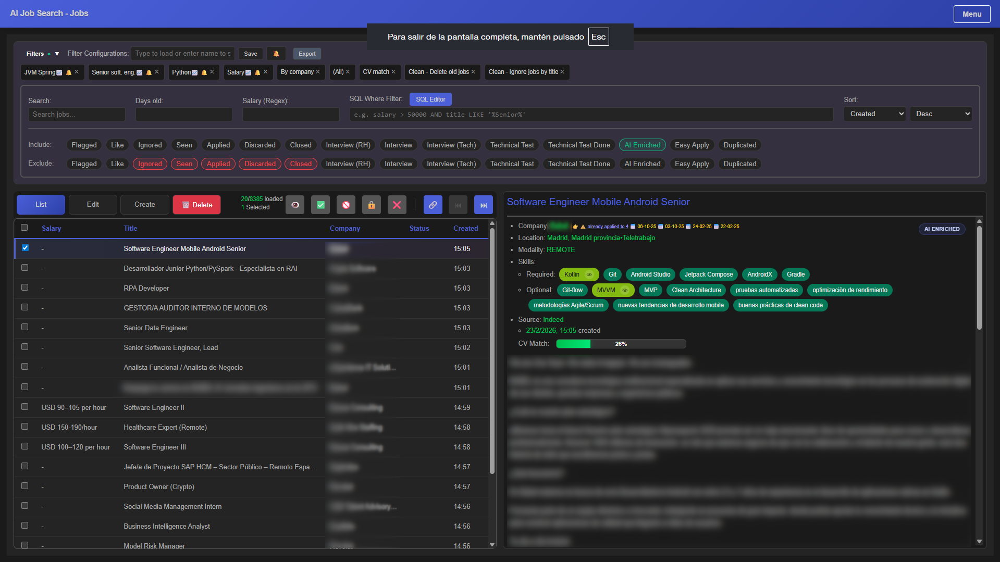
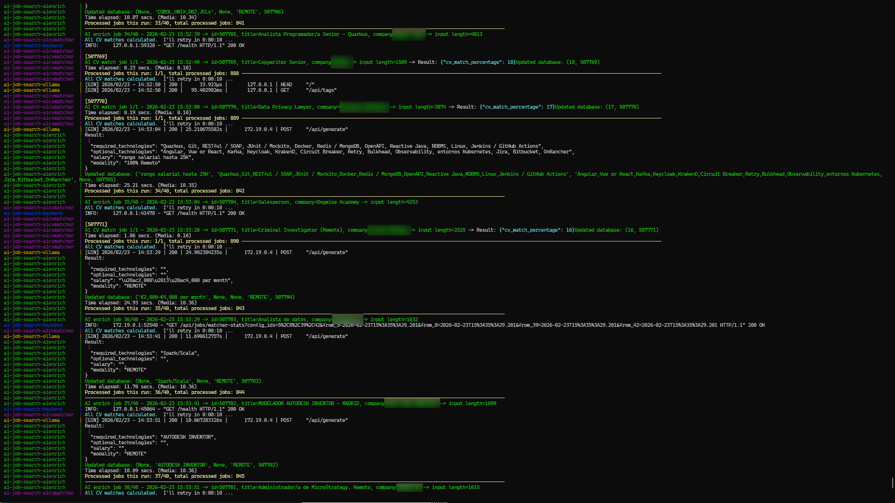
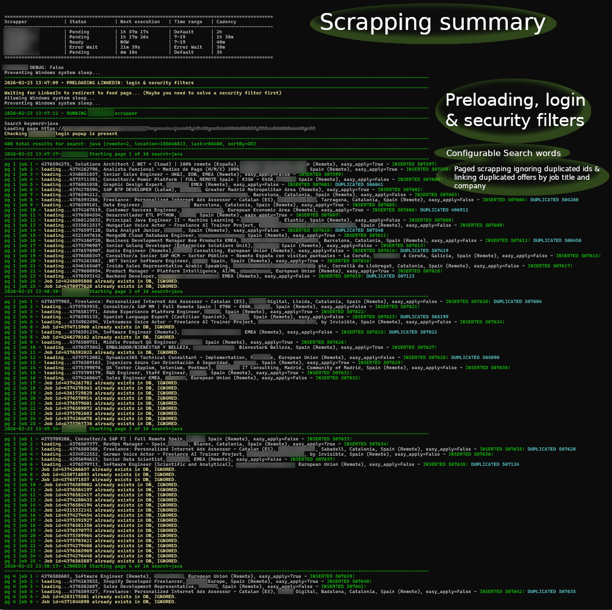
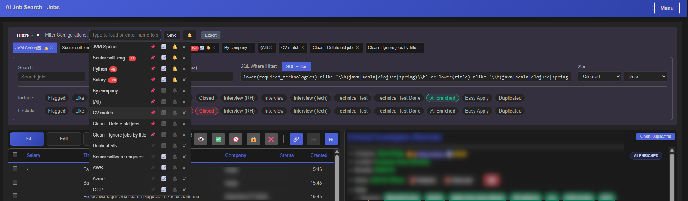
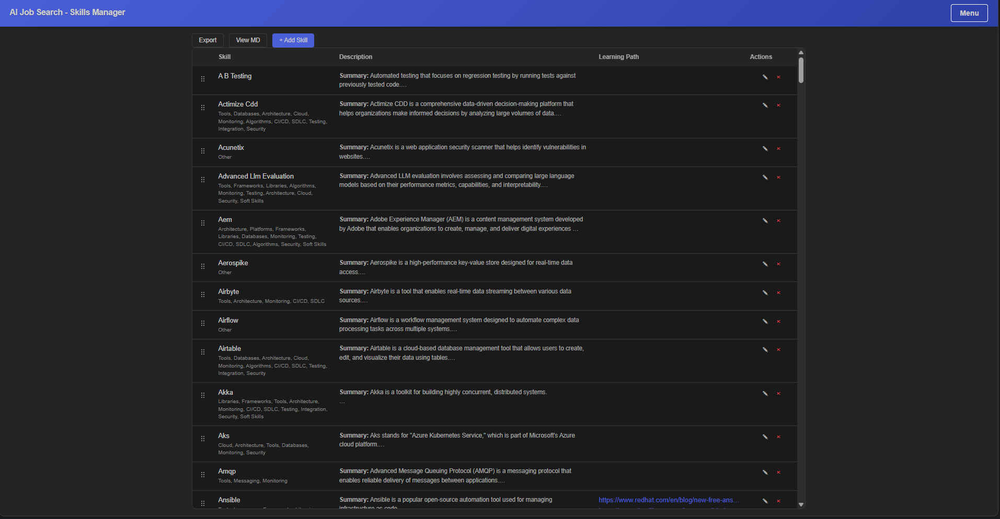
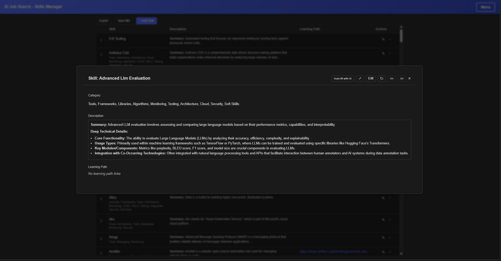
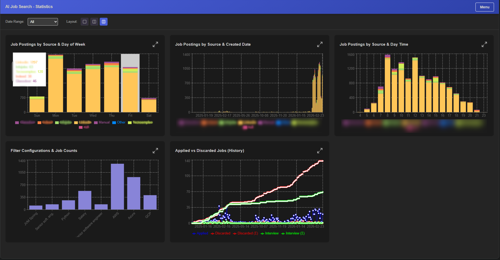
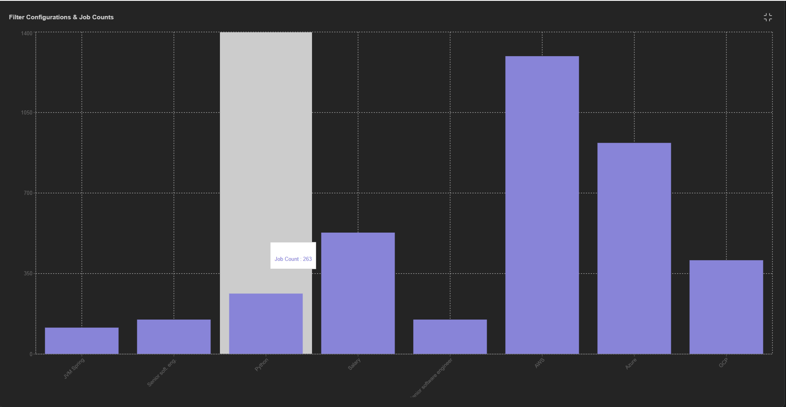
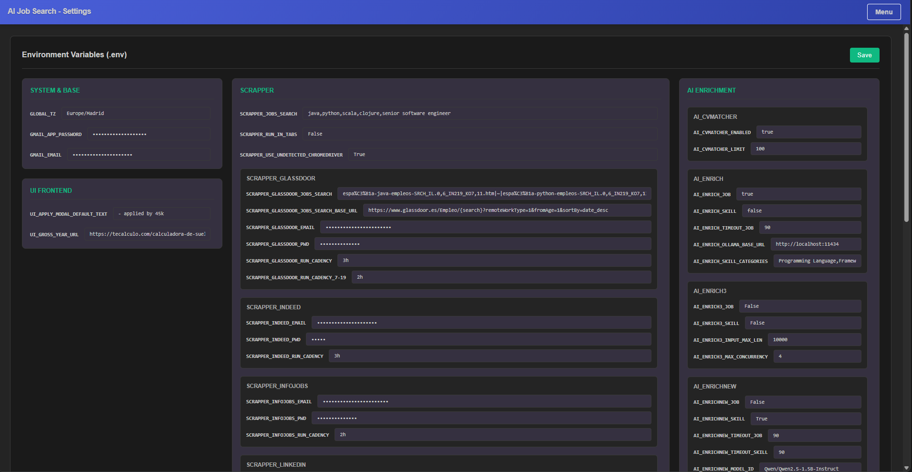
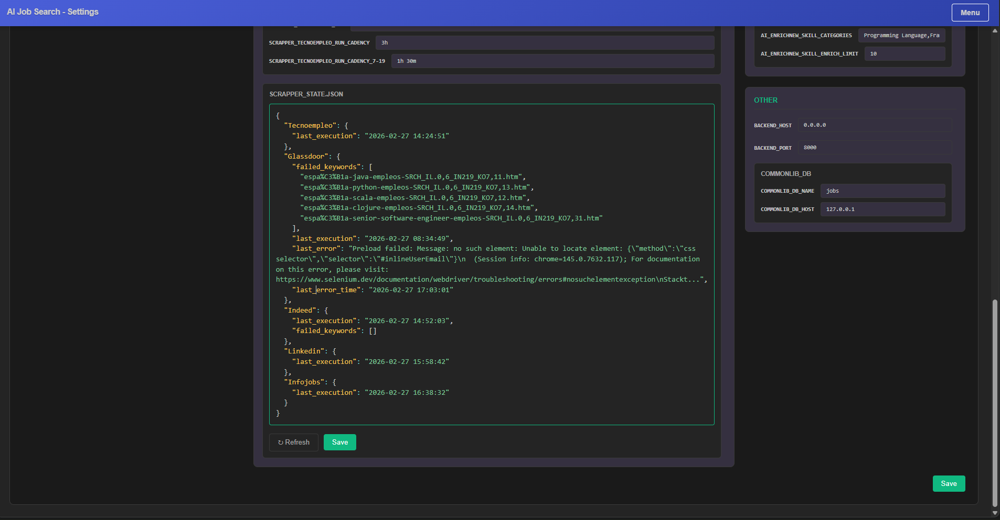

# AI Job Search Monorepo  [](https://github.com/davidgfolch/AI-job-search/actions/workflows/ci.yml)


A comprehensive system to search, aggregate, and manage job offers from multiple platforms (LinkedIn, Infojobs, Glassdoor, etc.), enriched with AI.

## Project Structure

This is a monorepo containing several applications and packages:

| Component        | Path                                                 | Description                                               | Tech Stack                   |
| ---------------- | ---------------------------------------------------- | --------------------------------------------------------- | ---------------------------- |
| **Common Lib**   | [`apps/commonlib`](apps/commonlib/README.md)         | Shared Python utilities and database logic.               | Python, Poetry               |
| **Web UI**       | [`apps/web`](apps/web/README.md)                     | Modern React frontend for job management.                 | React, TypeScript, Vite, npm |
| **Backend API**  | [`apps/backend`](apps/backend/README.md)             | FastAPI backend serving the Web UI.                       | Python, FastAPI, Poetry      |
| **Cron**         | [`apps/cron`](apps/cron/README.md)                   | Background scheduler for periodic cron jobs.              | Python, uv, MongoDB          |
| **Scrapper**     | [`apps/scrapper`](apps/scrapper/README.md)           | Selenium-based job scrapers.                              | Python, Selenium, Poetry     |
| **AI Enrich**    | [`apps/aiEnrich`](apps/aiEnrich/README.md)           | Local AI enrichment using Ollama                          | Python, CrewAI, uv           |
| **AI Enrich New**| [`apps/aiEnrichNew`](apps/aiEnrichNew/README.md)     | Local AI enrichment using transformers pipeline           | Python, HuggingFace, uv      |
| **AI Enrich 3**  | [`apps/aiEnrich3`](apps/aiEnrich3/README.md)         | Local AI enrichment using CPU models (GLiNER & mDeBERTa). | Python, ML Models, uv        |
| **AI CV Matcher**| [`apps/aiCvMatcher`](apps/aiCvMatcher/README.md)     | Local fast CV matching.                                   | Python, SentenceTransformers |
| **AI Form Filler**| [`apps/aiFormFiller`](apps/aiFormFiller/README.md) | AI-powered form question answerer using CV + preferences. | Python, FastAPI, HuggingFace |

## Features

- Scrapping jobs from multiple platforms
- UI to manage job offers (& skills)
- AI enrichment of job offers (salary, skills, work modality)
- AI enrichment of skills
- AI CV matching
- AI Form Filler (browser extension + backend) to answer job application questions using your CV
- **Settings UI** to manage `.env` / `.env.secrets` variables and scrapper state directly from the browser
- **Seamless API Routing**: Frontend automatically routes API requests seamlessly depending on environment (Docker bridge vs native localhost) and supports access from remote devices natively.

## Distributed execution

You can have specific mysql host server setting the `.env` ->  `COMMONLIB_DB_HOST` to your mysql database host IP.
You can run scrapper in a (linux recommended) & connect to another mysql host pc.
(Only tested, scrapper pc connecting to another LAN PC executing all other services including db)
TODO: running in several machines AI services, Ollama, backend, etc.

### MySQL host auto-discovery

`COMMONLIB_DB_HOST` supports single IPs, CIDR, ranges, and comma-separated combinations, with automatic LAN fallback. See [commonlib docs](apps/commonlib/README.md#mysql-connection) for details.

## Screenshots

### UI Management



### AI daemons & fullstack app logs



### Scrapper



### Filters Configurations



### Skills Manager



### Skills Edit



### Stats



### Stats Filter Configurations



### Settings — Environment Variables



### Settings — Scrapper State



## Getting Started

### Docker Compose Profiles

The `docker-compose.yml` defines several service profiles to control which containers start:

| Profile        | Services                          | Description                      |
| -------------- | --------------------------------- | -------------------------------- |
| _(default)_    | `mysql_db`, `backend`, `web`, `ollama`, `aicvmatcher`, `aiformfiller` | Unprofiled core services (always start) |
| `aienrich`     | `aienrich`                        | CrewAI AI enrichment             |
| `aiEnrichNew`  | `aienrichnew`                     | Transformers-based AI enrichment |
| `aiEnrich3`    | `aienrich3`                       | Fast CPU AI enrichment (GLiNER & mDeBERTa) |
| `scrapper`     | `scrapper`                        | Selenium-based job scraper       |

**Auto-started** (no `--profile` flag): `mysql_db`, `backend`, `web`, `ollama`, `aicvmatcher`, `aiformfiller`.
Use `--profile` to run alternative AI enrichment services:

```bash
docker-compose --profile aiEnrich3 up -d
docker-compose --profile aiEnrichNew up -d
```

The **scrapper** runs as a batch job (not long-running). Start it manually:
```bash
docker-compose --profile scrapper run scrapper
```

### Quick Start

- Copy `scripts/.env.example` to `.env` and `scripts/.env.secrets.example` to `.env.secrets`:
  - set your credentials in `.env.secrets`.
  - set your options in `.env` (e.g., SCRAPPER_JOBS_SEARCH, CV_MATCH flag, etc.)
- Run dockerized applications `docker-compose up -d` (starts default services).
- Run `apps/scrappers/run.(bat/sh)` in terminal.
- Navigate to UI at [http://localhost:5173](http://localhost:5173)
- Run (optional) alternative AI Enrichment tools:
  - Default runs `aiEnrich`. If you want to use the others:
  - Run `aiEnrich3` (local fast CPU models) with `docker-compose --profile aiEnrich3 up -d`.
  - Alternatively, `docker-compose --profile aiEnrichNew up -d` for the transformers-based engine.
- Run `aiCvMatcher` (local fast CV matching):
  - It runs by default via `docker-compose up -d` if enabled. Make sure `AI_CV_MATCH=True` is in your `.env`.
- Run `aiFormFiller` (AI-powered form question answerer):
  - Auto-starts with Docker by default. Alternatively run manually with `.\apps\aiFormFiller\run.bat`.
  - Load the `apps/aiFormFiller/extension/` folder as an unpacked extension in Chrome.
  - Right-click any form field → "Answer with AI".

NOTE: scrapper is not tested in docker yet, so you usually need to run it manually.

### Installation

Please see [README_INSTALL.md](READMEs/README_INSTALL.md) for detailed setup instructions.

### Run with Docker 🐳

You can run for development or just to use it.

```bash
docker-compose up -d
docker-compose logs -f
```

Then run the scrappers in a separate terminal:

```bash
./apps/scrapper/run.sh # or .bat
```

See [DOCKER_DEV.md](READMEs/DOCKER_DEV.md).

## Run Manually (Using Helper Scripts)

Each application includes convenience scripts (`run.sh` / `run.bat`) to start them easily.

### Linux / macOS (`.sh`)

```bash
# 1. Database
./scripts/runMysql.sh

# 2. Scrappers
./apps/scrapper/run.sh

# 3. AI Enrichment
# (NEW CPU and quicker)
./apps/aiEnrich3/run.sh
# (NEW GPU/Transformers pipeline)
./apps/aiEnrichNew/run.sh
# (Using CrewAI and Ollama)
./apps/aiEnrich/run.sh
# (Local Fast CV Matcher)
./apps/aiCvMatcher/run.sh
# (AI Form Filler backend)
./apps/aiFormFiller/run.sh

# 4. New UI (Backend + Web)
./apps/backend/run.sh
./apps/web/run.sh
```

### Windows (`.bat`)

```cmd
:: 1. Database
docker compose up -d

:: 2. Scrappers
.\apps\scrapper\run.bat

:: 3. AI Enrichment
:: (NEW CPU and quicker)
.\apps\aiEnrich3\run.bat
:: (NEW GPU/Transformers pipeline)
.\apps\aiEnrichNew\run.bat
:: (Using CrewAI and Ollama)
.\apps\aiEnrich\run.bat
:: (Local Fast CV Matcher)
.\apps\aiCvMatcher\run.bat
:: (AI Form Filler backend)
.\apps\aiFormFiller\run.bat

:: 4. New UI (Backend + Web)
.\apps\backend\run.bat
.\apps\web\run.bat
```

## Documentation

- **Installation**: [README_INSTALL.md](READMEs/README_INSTALL.md)
- **Development**: [README_DEVELOPMENT.md](READMEs/README_DEVELOPMENT.md)
- **Contributing**: [README_CONTRIBUTE.md](READMEs/README_CONTRIBUTE.md)
- **Docker**: [DOCKER_DEV.md](READMEs/DOCKER_DEV.md)
