# AI Job Search Monorepo  [](https://github.com/davidgfolch/AI-job-search/actions/workflows/ci.yml?branch=master)  [](https://github.com/davidgfolch/AI-job-search/actions/workflows/ci.yml?branch=staging)


A comprehensive system to search, aggregate, and manage job offers from multiple platforms (LinkedIn, Infojobs, Glassdoor, etc.), enriched with AI job offer structured data extraction, skills/technologies description inference, etc.

## Project Structure

This is a monorepo containing several applications and packages:

| Component        | Path                                                 | Description                                               | Tech Stack                   |
| ---------------- | ---------------------------------------------------- | --------------------------------------------------------- | ---------------------------- |
| **Common Lib**   | [`apps/commonlib`](apps/commonlib/README.md)         | Shared Python utilities and database logic.               | Python, Poetry               |
| **Web UI**       | [`apps/web`](apps/web/README.md)                     | Modern React frontend for job management.                 | React, TypeScript, Vite, npm |
| **Backend API**  | [`apps/backend`](apps/backend/README.md)             | FastAPI backend serving the Web UI.                       | Python, FastAPI, Poetry      |
| **Cron**         | [`apps/cron`](apps/cron/README.md)                   | Background scheduler for periodic cron jobs.              | Python, uv, MongoDB          |
| **Scrapper**     | [`apps/scrapper`](apps/scrapper/README.md)           | Selenium-based job scrapers.                              | Python, Selenium, Poetry     |
| **AI Enrich**    | [`apps/aiEnrich`](apps/aiEnrich/README.md)           | Local AI enrichment using Ollama                          | Python, Ollama, uv           |
| **AI Enrich New**| [`apps/aiEnrichNew`](apps/aiEnrichNew/README.md)     | Local AI enrichment using transformers pipeline           | Python, HuggingFace, uv      |
| **AI Enrich 3**  | [`apps/aiEnrich3`](apps/aiEnrich3/README.md)         | Local AI enrichment using CPU models (GLiNER & mDeBERTa). | Python, ML Models, uv        |
| **AI Enrich Skill**| [`apps/aiEnrichSkill`](apps/aiEnrichSkill/README.md) | Local AI skill enrichment (Ollama & HuggingFace).        | Python, Transformers, uv     |
| **AI CV Matcher**| [`apps/aiCvMatcher`](apps/aiCvMatcher/README.md)     | Local fast CV matching.                                   | Python, SentenceTransformers |
| **AI Form Filler**| [`apps/aiFormFiller`](apps/aiFormFiller/README.md) | AI-powered form question answerer using CV + preferences. | Python, FastAPI, HuggingFace |

## Features

- Scrapping jobs from multiple platforms
- UI to manage job offers (& skills)
- AI enrichment of job offers (salary, skills, work modality)
- AI enrichment of skills
- AI CV matching
- AI Form Filler (browser extension + backend) to answer job application questions using your CV
- **Observability**: Structured logging + Prometheus metrics via `commonlib`; scraped by Prometheus (`:9090`) → Grafana dashboard (`:3000`, admin/admin); JSON API at `GET /api/enrichment/metrics`
- **Settings UI** to manage `.env` / `.env.secrets` variables and scrapper state directly from the browser
- **Seamless API Routing**: Frontend automatically routes API requests seamlessly depending on environment (Docker bridge vs native localhost) and supports access from remote devices natively.

## CI / GitHub Automation

The CI pipeline, Dependabot version updates, and automatic merging of dependency PRs are documented in [GitHub Automation](READMEs/README_GITHUB.md). In short: CI only tests the modules affected by a change, Dependabot groups non-breaking updates per app, and green minor/patch Dependabot PRs auto-merge (majors stay manual; failing PRs never merge).

## Distributed execution

You can have specific mysql host server setting the `.env` ->  `COMMONLIB_DB_HOST` to your mysql database host IP.
You can run scrapper in a (linux recommended) & connect to another mysql host pc.
(Only tested, scrapper pc connecting to another LAN PC executing all other services including db)
TODO: running in several machines AI services, Ollama, backend, etc.

### Scrapper MySQL host auto-discovery

`COMMONLIB_DB_HOST` supports single IPs, CIDR, ranges, and comma-separated combinations, with automatic LAN fallback. See [commonlib docs](apps/commonlib/README.md#mysql-connection) for details.

### Web Backend API auto-discovery

Set `BACKEND_DISCOVERY=True` in `.env` to enable automatic LAN discovery of the backend API (port 8000). When enabled, the web app scans local subnets and probes `/health` to find the backend. Falls back to `localhost:8000` if nothing is found. See [web docs](apps/web/README.md#backend-discovery) for details.

Run only web in the client machine like this:

```bash
docker-compose up -d --no-deps web
```

## Screenshots

### UI Management

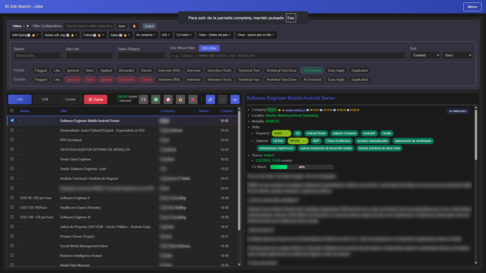

### AI daemons & fullstack app logs

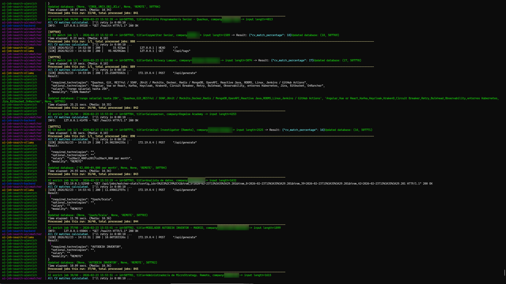

### Scrapper

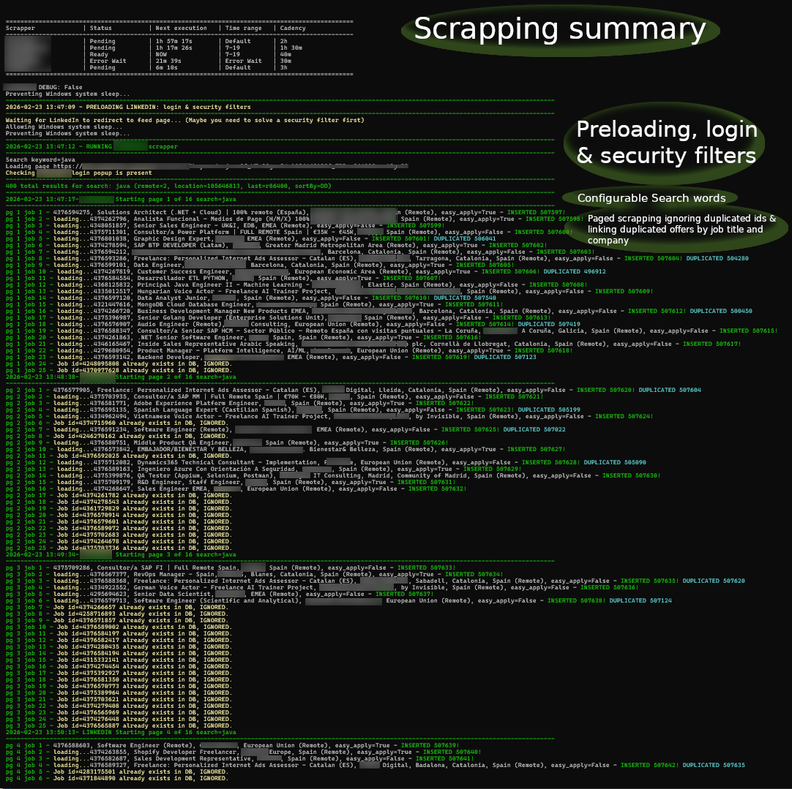

### Filters Configurations

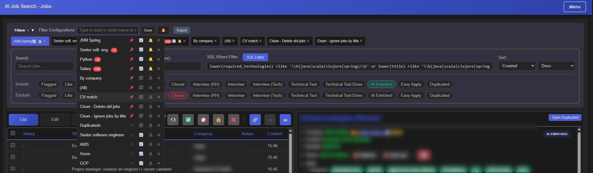

### Skills Manager

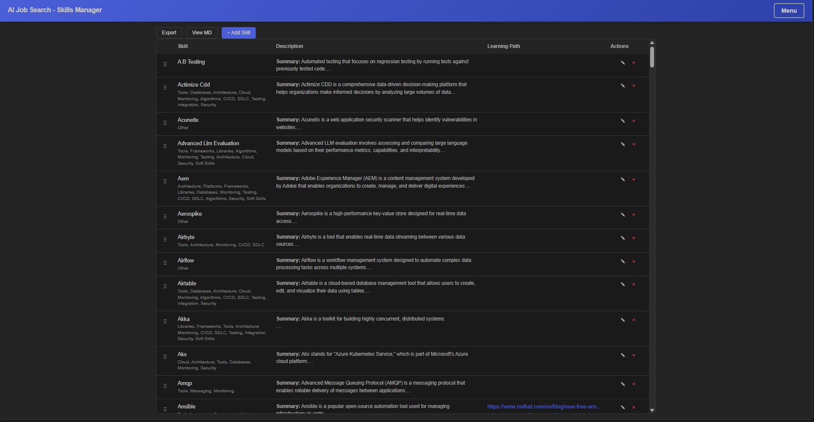

### Skills Edit

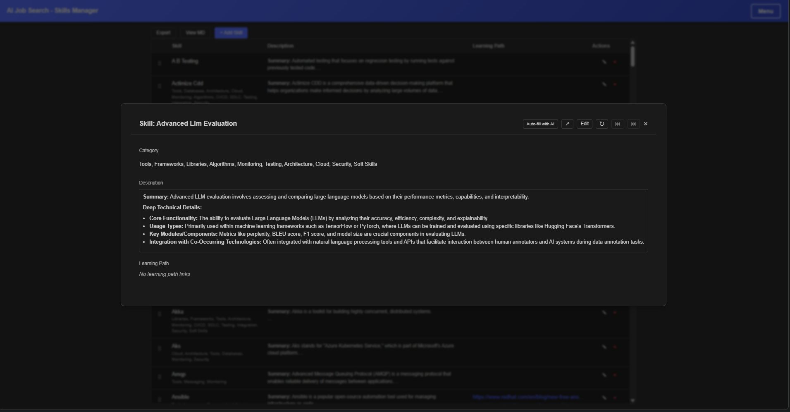

### Stats

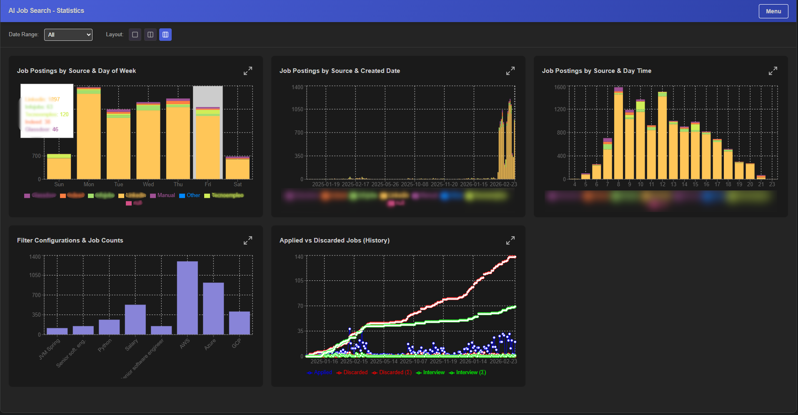

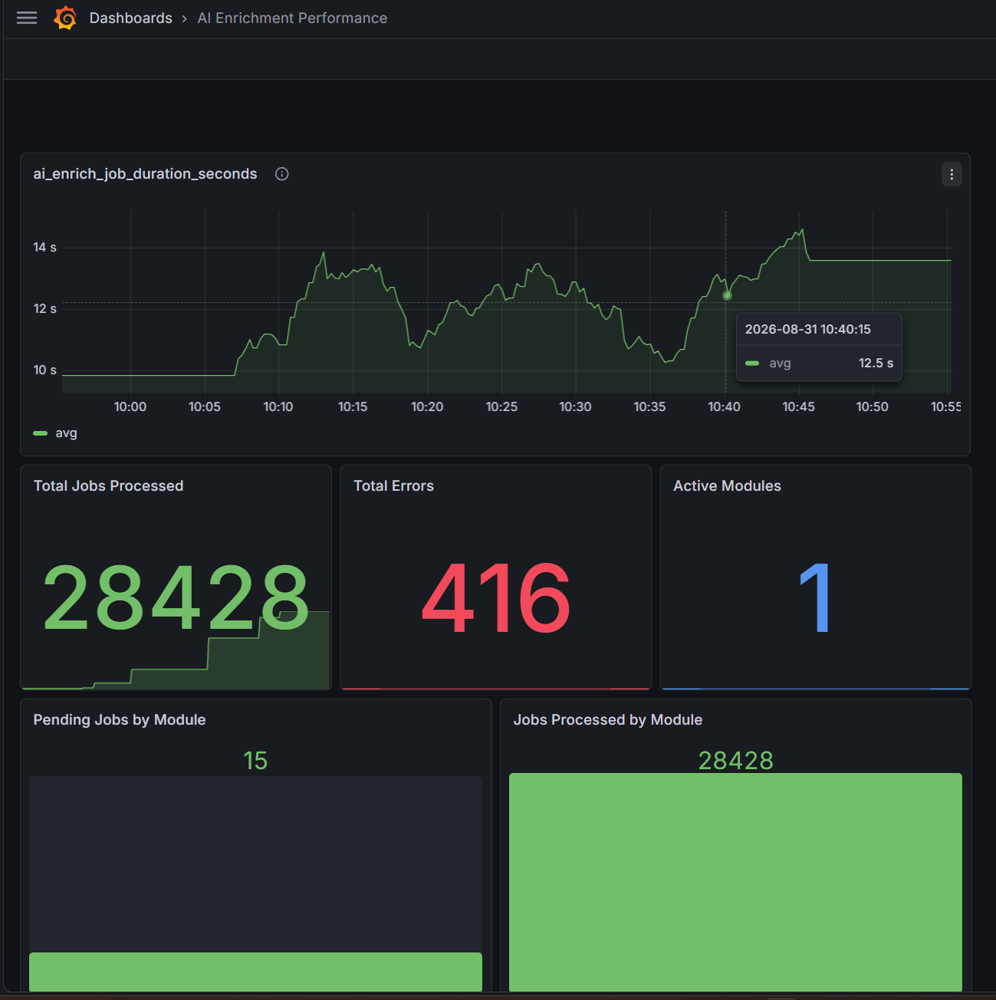

### Stats Filter Configurations

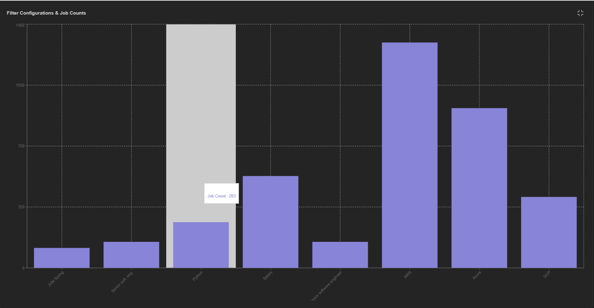

### Settings — Environment Variables

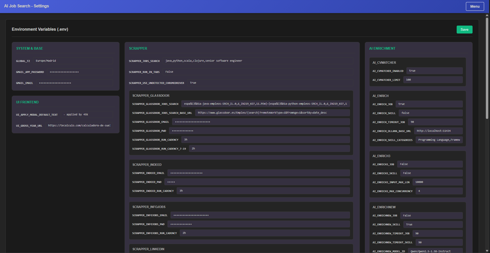

### Settings — Scrapper State

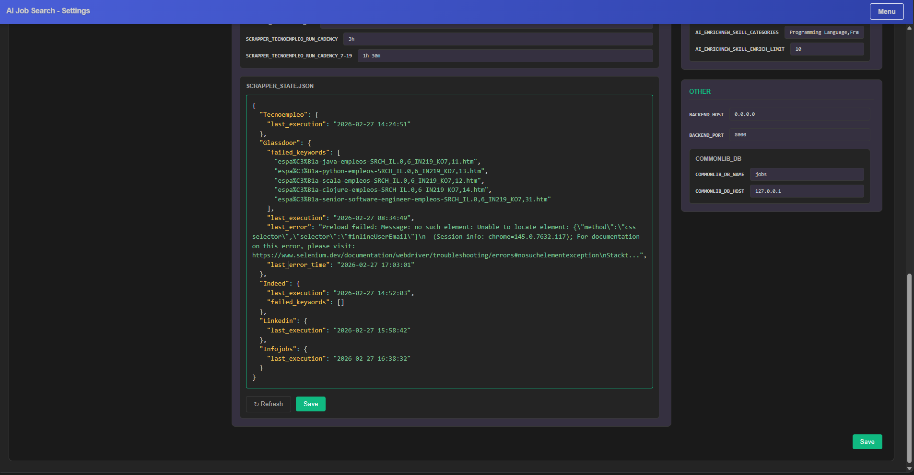

## Getting Started

### Docker Compose Profiles

The `docker-compose.yml` defines several service profiles to control which containers start:

| Profile        | Services                          | Description                      |
| -------------- | --------------------------------- | -------------------------------- |
| _(default)_    | `mysql_db`, `backend`, `web`, `ollama`, `aicvmatcher`, `aiformfiller`, `prometheus`, `grafana` | Unprofiled core services (always start) |
| `aienrich`     | `aienrich`                        | Ollama AI enrichment             |
| `aiEnrichNew`  | `aienrichnew`                     | Transformers-based AI enrichment |
| `aiEnrichSkill`| `aienrichskill`                   | AI skill enrichment (Ollama & HuggingFace) |
| `aiEnrich3`    | `aienrich3`                       | Fast CPU AI enrichment (GLiNER & mDeBERTa) |
| `scrapper`     | `scrapper`                        | Selenium-based job scraper       |

**Auto-started** (no `--profile` flag): `mysql_db`, `backend`, `web`, `ollama`, `aicvmatcher`, `aiformfiller`.
Use `--profile` to run alternative AI enrichment services:

```bash
docker-compose --profile aiEnrich3 up -d
docker-compose --profile aiEnrichNew up -d
```

The **scrapper** runs as a batch job (not long-running). Start it manually:
```bash
docker-compose --profile scrapper run scrapper
```

### Quick Start

- Copy `scripts/.env.secrets.example` to `.env.secrets` and set your credentials there.
- Set your options in `.env` (e.g., SCRAPPER_JOBS_SEARCH, CV_MATCH flag, etc.)
- Run dockerized applications `docker-compose up -d` (starts default services).
- Run `apps/scrappers/run.(bat/sh)` in terminal.
- Navigate to UI at [http://localhost:5173](http://localhost:5173)
- Run (optional) alternative AI Enrichment tools:
  - Default runs `aiEnrich`. If you want to use the others:
  - Run `aiEnrich3` (local fast CPU models) with `docker-compose --profile aiEnrich3 up -d`.
  - Alternatively, `docker-compose --profile aiEnrichNew up -d` for the transformers-based engine.
- Run `aiCvMatcher` (local fast CV matching):
  - It runs by default via `docker-compose up -d` if enabled. Make sure `AI_CV_MATCH=True` is in your `.env`.
- Run `aiFormFiller` (AI-powered form question answerer):
  - Auto-starts with Docker by default. Alternatively run manually with `.\apps\aiFormFiller\run.bat`.
  - Load the `apps/aiFormFiller/extension/` folder as an unpacked extension in Chrome.
  - Right-click any form field → "Answer with AI".

NOTE: scrapper is not tested in docker yet, so you usually need to run it manually.

### Installation

Please see [README_INSTALL.md](READMEs/README_INSTALL.md) for detailed setup instructions.

### Run with Docker 🐳

You can run for development or just to use it.

```bash
docker-compose up -d
docker-compose logs -f
```

Then run the scrappers in a separate terminal:

```bash
./apps/scrapper/run.sh # or .bat
```

> **After changing web dependencies**, just rebuild and restart the web container:
> `docker-compose up -d --build web`. Its entrypoint auto-detects the changed
> `package-lock.json` and reinstalls `node_modules` on start.

See [DOCKER_DEV.md](READMEs/DOCKER_DEV.md).

## Run Manually (Using Helper Scripts)

Each application includes convenience scripts (`run.sh` / `run.bat`) to start them easily.

### Linux / macOS (`.sh`)

```bash
# 1. Database
./scripts/runMysql.sh

# 2. Scrappers
./apps/scrapper/run.sh

# 3. AI Enrichment
# (NEW CPU and quicker)
./apps/aiEnrich3/run.sh
# (NEW GPU/Transformers pipeline)
./apps/aiEnrichNew/run.sh
# (Using Ollama)
./apps/aiEnrich/run.sh
# (Local Fast CV Matcher)
./apps/aiCvMatcher/run.sh
# (AI Form Filler backend)
./apps/aiFormFiller/run.sh

# 4. New UI (Backend + Web)
./apps/backend/run.sh
./apps/web/run.sh
```

### Windows (`.bat`)

```cmd
:: 1. Database
docker compose up -d

:: 2. Scrappers
.\apps\scrapper\run.bat

:: 3. AI Enrichment
:: (NEW CPU and quicker)
.\apps\aiEnrich3\run.bat
:: (NEW GPU/Transformers pipeline)
.\apps\aiEnrichNew\run.bat
:: (Using Ollama)
.\apps\aiEnrich\run.bat
:: (Local Fast CV Matcher)
.\apps\aiCvMatcher\run.bat
:: (AI Form Filler backend)
.\apps\aiFormFiller\run.bat

:: 4. New UI (Backend + Web)
.\apps\backend\run.bat
.\apps\web\run.bat
```

## Knowledge Graph

The project uses [graphify](https://github.com/safishamsi/graphifyy) to build a navigable knowledge graph of the codebase architecture. Each `apps/*` module is extracted independently, then merged with cross-module dependency edges.

### Build the graph

```bash
# Linux/Mac
./scripts/graphify/graphify.sh

# Windows
.\scripts\graphify\graphify.bat
```

Flags:

- `--clean` — purge old graph data only
- `--module <name>` — re-extract a single module (e.g. `--module web`)

Outputs in `graphify-out/`:

| File                      | Description                                              |
|---------------------------|----------------------------------------------------------|
| `graph.html`              | Interactive graph visualization grouped by module (open in browser) |
| `GRAPH_REPORT.md`         | Architecture audit report with god nodes and communities |
| `graph.json`              | Raw graph data for programmatic queries                  |
| `cross-module-edges.json` | Editable cross-module dependency definitions             |

The interactive `graph.html` renders the graph as a deterministic matrix: rows
are grouped into bands per module (major) and per folder layer (minor), files
flow side-by-side within each layer band (wrapping into rows), and each file's
nodes are laid out left-to-right as `file -> component -> method`
(module-level functions sit with components; docstring rationales sit in a meta
column; a rightmost column holds external nodes). The files-per-row packing is
chosen adaptively so the whole graph is roughly square, and faint module/layer
bands with labels are drawn under the nodes for orientation. Node colors are assigned per module (base hue per module, shade per
community) so the graph is visually organized by app while keeping every edge,
including cross-module edges, intact. Three sidebar toggles control display
noise: "Show external/library nodes" (imported modules, symbols, and type
annotations like `Any`, shown in a muted color; off by default), "Show file
nodes" (on by default), and "Show private methods" (`_foo()` / `._foo()` /
dunders like `.__init__()`; off by default). The matrix view is generated by
`scripts/graphify/graphify-html-grouped.py`
(Step 5 of the pipeline), which fills the HTML/CSS/JS template at
`scripts/graphify/templates/graphify-html.tpl`; re-run `scripts/graphify/graphify.sh` /
`scripts/graphify/graphify.bat` to regenerate it.

### Graph view

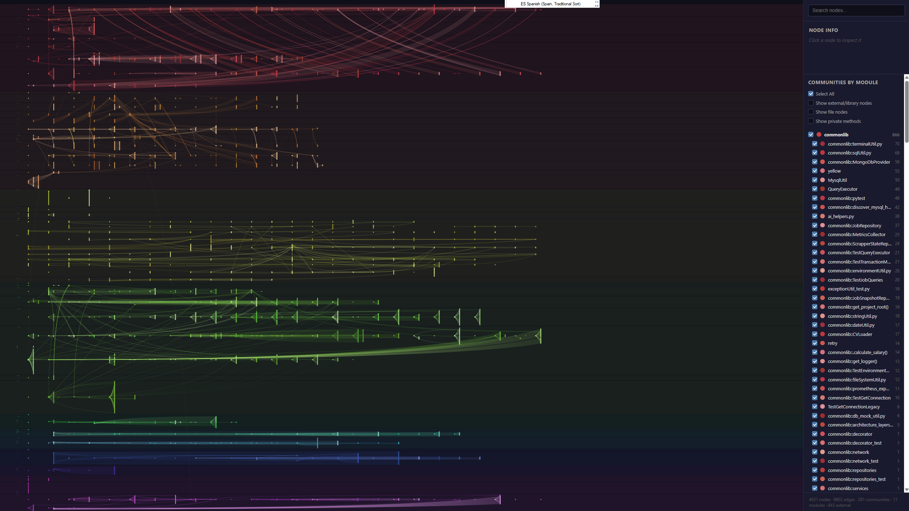
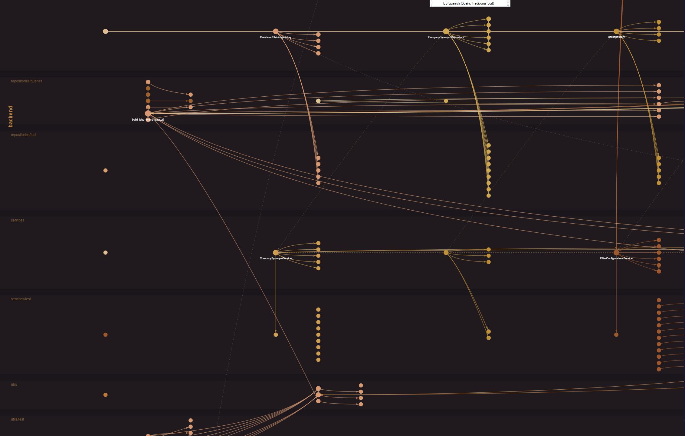

### Query the graph

```bash
graphify query "show subsystems and their main entrypoints"
graphify path "web" "commonlib"
graphify explain "ScrapperScheduler"
```

### Cross-module edges

Inter-module relationships are defined in `graphify-out/cross-module-edges.json`. Edit this file to add or modify dependencies, then re-run the script.

## Documentation

- **Installation**: [README_INSTALL.md](READMEs/README_INSTALL.md)
- **Development**: [README_DEVELOPMENT.md](READMEs/README_DEVELOPMENT.md)
- **Contributing**: [README_CONTRIBUTE.md](READMEs/README_CONTRIBUTE.md)
- **Docker**: [DOCKER_DEV.md](READMEs/DOCKER_DEV.md)
- **GitHub Automation (CI & Dependabot)**: [README_GITHUB.md](READMEs/README_GITHUB.md)
